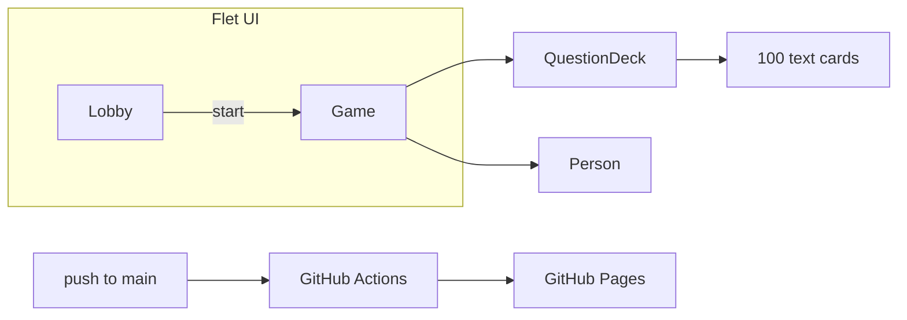

<div align="center">

# Rundan

**Desktop party card game · Python & Flet**

*Programming 2 · Göteborgs universitet · 2023 · Solo project · refaktorerat 2026*

**[▶ Spela i webbläsaren](https://linneaegner.github.io/do-or-lose/)**

[Features](#features) · [Spela](#spela) · [Quick start](#quick-start) · [Architecture](#architecture) · [Context](#context)

</div>

---

## Overview

**Rundan** is a Swedish turn-based party card game for friends: add players in a lobby, pick categories, draw text challenge cards, and pass turns until the deck runs out. Built with **Python 3.11+** and **Flet 0.85** as coursework for *Programming 2* at the University of Gothenburg (2023), refactored in 2026 with a text-card deck, category filters, pytest, and a playable web version on GitHub Pages.

## Features

| Area | What it does |
|------|----------------|
| **Lobby** | Add players (min. 2), validation, removable player chips |
| **Categories** | Toggle five card types: Sanning, Utmaning, Drick, Rösta, Vild |
| **Game** | Turn order, tap-to-draw cards, deck counter, reshuffle when empty |
| **Cards** | 100 Swedish text prompts across five categories |
| **UI** | Dark pre-party theme, responsive layout, Swedish copy |
| **Web** | Play in the browser — no install; one shared screen |

## Spela

**Ingen installation** — öppna länken i webbläsaren (mobil eller laptop). Ett kortspel för **en delad skärm**: lägg in alla spelare, välj kategorier, dra kort i turordning.

**https://linneaegner.github.io/do-or-lose/**

| | |
|---|---|
| **Första besök** | Räkna med ~10–20 s laddning (Python körs i webbläsaren via Pyodide) |
| **Uppdateringar** | Varje push till `main` bygger om och publicerar automatiskt — samma länk, ingen ny nedladdning |
| **Redan öppen sida?** | Ladda om (F5 / dra-ner-refresh) efter att du pushat ny kod |

GitHub Pages måste ha **GitHub Actions** som källa ([Settings → Pages](https://github.com/linneaegner/do-or-lose/settings/pages)).

## Screenshots

| Lobby | Card draw | Game |
|:-----:|:---------:|:----:|
|  |  |  |

> To refresh screenshots after UI changes: run the app, capture lobby (with players + categories), an active card draw, and the game screen. Save as `docs/screenshots/lobby.png`, `game.png`, and optionally `home.png`.

## Quick start

**Requirements:** Python 3.11+, macOS or Linux (desktop tested on macOS). For playing with friends, use the [web link](#spela) instead.

```bash
git clone https://github.com/linneaegner/do-or-lose.git
cd do-or-lose
python3 -m venv .venv
source .venv/bin/activate   # Windows: .venv\Scripts\activate
pip install -r requirements.txt
flet run main.py
```

Or use the helper script (kills stale port, runs in web mode on `127.0.0.1:8550`):

```bash
chmod +x run.sh
./run.sh
```

**Tests** (optional):

```bash
pip install -r requirements-dev.txt
pytest
```

> **Flet 0.85:** Run inside the project `.venv` if a global Flet install conflicts.

## Architecture



| File | Role |
|------|------|
| `main.py` | App entry, lobby/game flow, turn loop |
| `models.py` | `Person` — player name and state |
| `questions.py` | `Category`, `Question`, `QuestionDeck` — 100 cards |
| `theme.py` | Shared UI components and layout |
| `constants.py` | Design tokens and game rules |
| `run.sh` | Convenience launcher (local web mode on `127.0.0.1:8550`) |
| `.github/workflows/build-deploy.yml` | Builds and deploys the web version on every push to `main` |

## Context

- **Original (2023):** University coursework — OOP desktop app with Flet instead of console I/O. Early version used image cards and Swedish UI.
- **This repo (2026):** Refactored **Rundan** — text-card deck, category filters, Flet 0.85, pytest, GitHub Pages deploy. Public on GitHub; not listed on [linneaegner.se](https://linneaegner.se).

## License

University coursework — see repository for usage.
