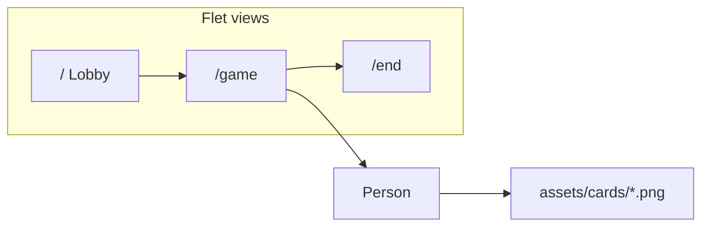

<div align="center">

# DO or LOSE

**Desktop turn-based party game · Python & Flet**

*Programming 2 · University of Gothenburg · 2023 · Solo project*

[Features](#features) · [Quick start](#quick-start) · [Architecture](#architecture) · [Context](#context)

</div>

---

## Overview

Coursework for **Programming 2**: build a desktop app with **object-oriented design**, **multi-view navigation**, and a real UI framework—not console output.

**DO or LOSE** is a social turn-based game: add players in the lobby, draw challenge cards, score points toward 100, and crown a winner. Refactored in 2026 for portfolio use (Flet 0.85, local assets, English UI).

## Features

| Area | What it does |
|------|----------------|
| **Lobby** | Add players (min. 2), validation, player chips |
| **Game** | Turn loop, animated card draw, +15 pts / skip, progress ring |
| **Routing** | Flet views for `/`, `/game`, `/end` |
| **Model** | `Person` class — name, card state, score with undo |
| **Assets** | Six challenge cards bundled locally (no hotlinks) |

## Quick start

**Requirements:** Python 3.11+, macOS or Linux (desktop tested on macOS)

```bash
git clone https://github.com/linneaegner/do-or-lose.git
cd do-or-lose
python3 -m venv .venv
source .venv/bin/activate
pip install -r requirements.txt
flet run main.py
```

**Tests** (optional):

```bash
pip install -r requirements-dev.txt
pytest
```

> **Flet 0.85:** Use `ft.View(route="...", controls=[...])` — positional args are reversed vs older Flet. Run inside the project `.venv` if a global Flet install conflicts.

## Architecture



| File | Role |
|------|------|
| `main.py` | App entry, routing, turn loop |
| `models.py` | `Person` — player state & scoring |
| `theme.py` | Shared UI components & layout |
| `constants.py` | Design tokens, game rules, paths |
| `assets/cards/` | Challenge card images |

## Context

- **Original:** 2023 university project (Swedish UI, Imgur card URLs).
- **This repo:** Standalone portfolio version — pinned deps, pytest, English copy, Flet 0.85 routing fix.
- **Portfolio site copy:** see [PORTFOLIO.md](PORTFOLIO.md).

## License

University coursework — see repository for usage.
