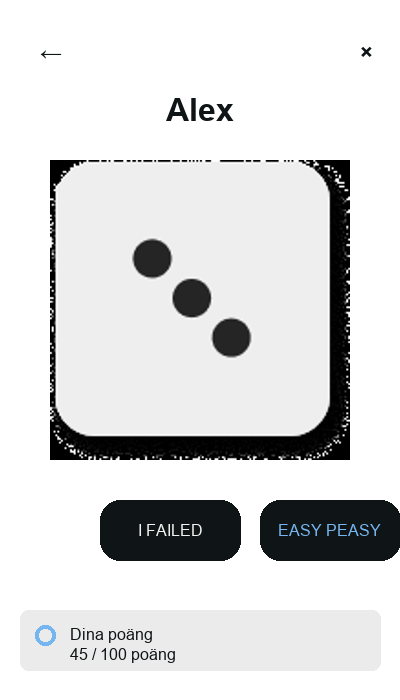

# DO or LOSE

Desktop turn-based multiplayer game from **Programming 2**, Uppsala University (2023). Python + Flet: OOP player model, routed views, local card assets.



## Run

```bash
python3 -m venv .venv && source .venv/bin/activate
pip install -r requirements.txt
flet run main.py
```

```bash
pytest   # optional — Person scoring
```

## Layout

| Path | Purpose |
|------|---------|
| `main.py` | UI, routing (`/`, `/game`, `/end`), turn loop |
| `models.py` | `Person` — name, card, points |
| `constants.py` | Limits, colors, card paths |
| `assets/cards/` | Challenge PNGs |

Lobby needs **at least two players** before start. UI copy is Swedish; code and docs are English.

## Notes

- **Flet 0.85.1** (macOS-tested). Use the project venv if an older global Flet install conflicts.
- Six local cards; the 2023 course version used Imgur URLs.

Portfolio blurbs for your site: **[PORTFOLIO.md](PORTFOLIO.md)**.

## License

University coursework — see repository for usage.
