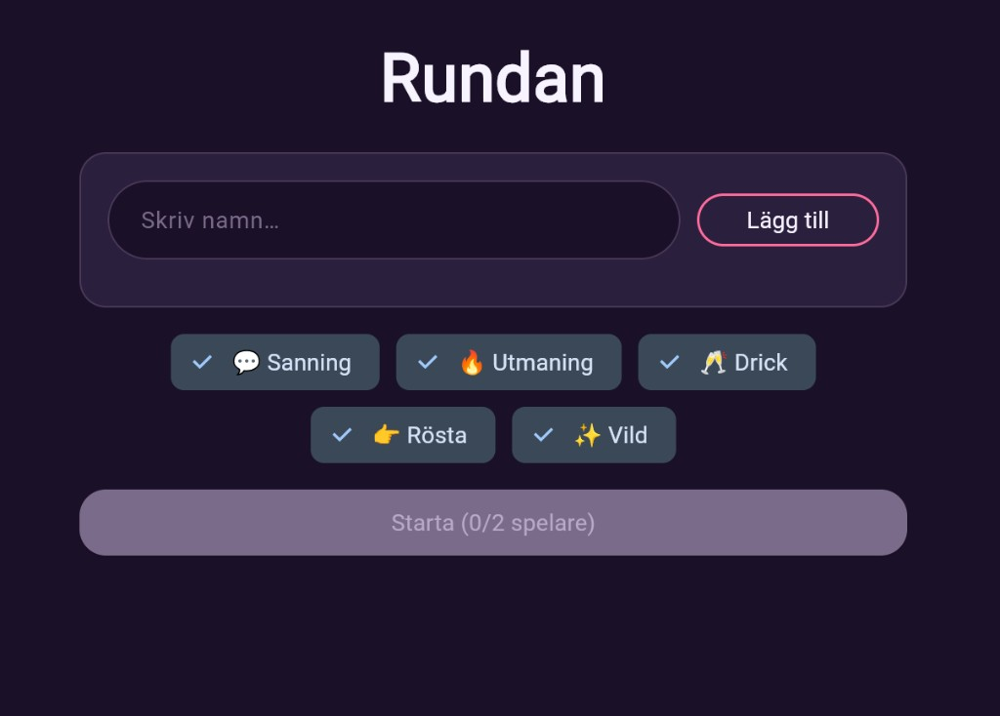
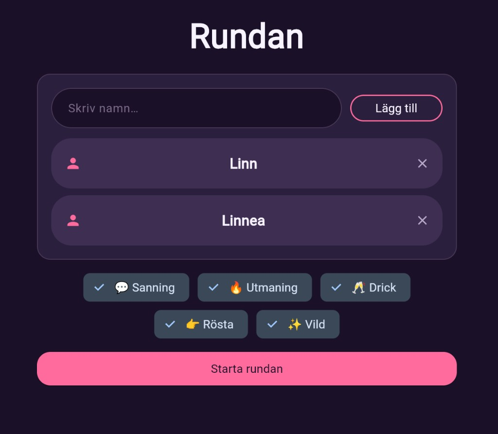
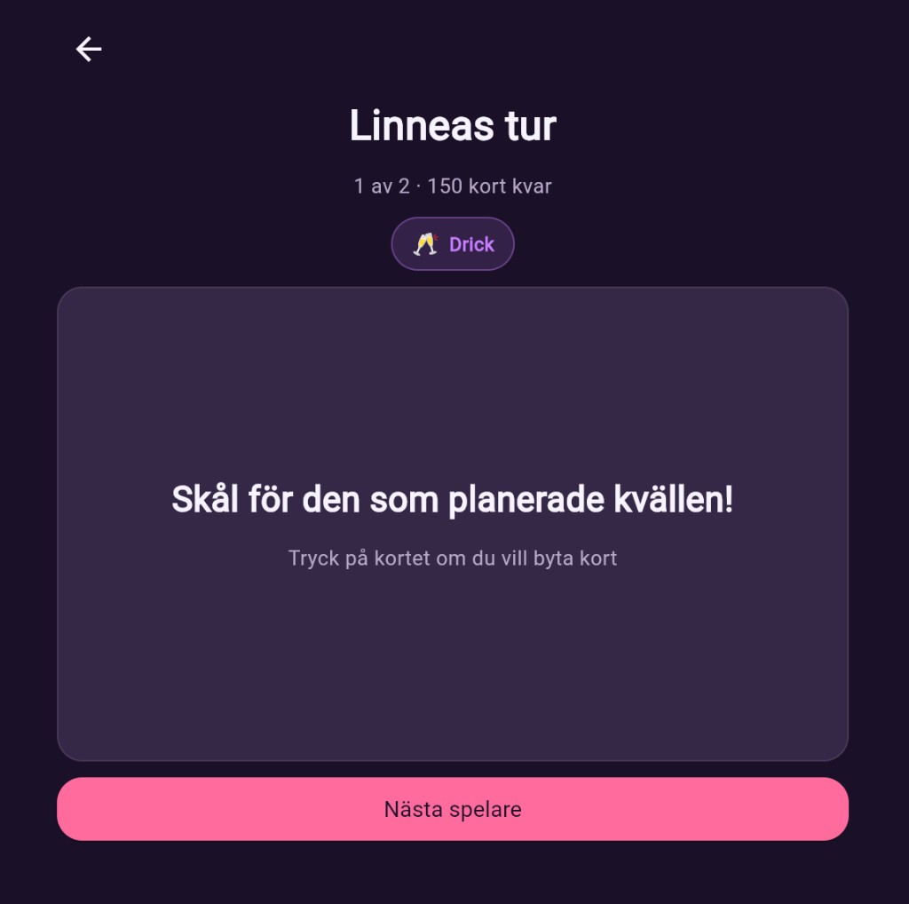

# Rundan

**Svenskt partykortspel · Python & Flet**

*[▶ Spela](https://linneaegner.github.io/rundan/)*

Turordnat partykortspel för vänner på **en delad skärm**. Lägg till spelare, välj kategorier, dra kort i turordning.

## Screenshots

   
   
  

---

Programming 2, GU 2023 · refaktorerat 2026
