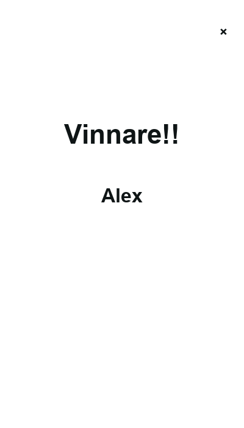

# DO or LOSE

A desktop turn-based multiplayer score-tracking app built for **Programming 2** at Uppsala University (2023). Players take turns drawing challenge cards and earning points until someone reaches 100.


## Problem

The course project needed a desktop app that combined **object-oriented design**, **multi-view navigation**, and a **real UI framework** — not just console output. I built a social party game where friends add names, flip random challenge cards, and track scores across turns.

## What I built

- **Flet desktop app** with three routed views: lobby (`/`), game (`/game`), winner (`/end`)
- **`Person` model** encapsulating name, current card, and score with add/undo logic
- **Turn loop** cycling players, drawing cards from local assets, and awarding 15 points per completed challenge
- **Progress UI** with a ring and score label per active player

## Tech stack

- Python 3.11+
- [Flet](https://flet.dev/) 0.85 (cross-platform desktop UI)
- Local PNG assets (no external image hotlinks)

## Architecture

```
main.py        → Flet views, routing, game loop, UI event handlers
models.py      → Person class (player state + scoring)
constants.py   → MAX_POINTS, card paths, colors, window size
assets/cards/  → Challenge card images
tests/         → Unit tests for Person scoring logic
```

**Routing:** `page.on_route_change` rebuilds `ft.View` stacks for `/`, `/game`, and `/end`. Back/close buttons call `page.go()` to navigate.

**Turn flow:** `next_round` advances `turn_index` modulo player count. Card flip uses `AnimatedSwitcher` + random local image. Success adds `POINTS_PER_SUCCESS`; reaching `MAX_POINTS` routes to the winner screen.

## Screenshots

| Lobby | Game | Winner |
|-------|------|--------|
|  |  |  |

## Getting started

### Prerequisites

- macOS (tested), Python 3.11+
- A virtual environment is recommended

### Install

```bash
git clone https://github.com/linneaegner/do-or-lose.git
cd do-or-lose
python3 -m venv .venv
source .venv/bin/activate
pip install -r requirements.txt
```

### Run

```bash
flet run main.py
```

Alternative: `python main.py`

### Test

```bash
pytest
```

## macOS notes

- Pinned to **Flet 0.85.1** — older Flet APIs (`ft.colors`, `page.window_width`, `CountinuosRectangleBorder`) were updated for this version.
- If `flet` is not found, ensure your venv is active or use `python -m pip install -r requirements.txt` and run via the venv’s `flet` binary.
- An older system-wide Flet install (e.g. via Anaconda) can conflict; prefer the project venv.

## Project context

Solo coursework project from 2023. UI copy is in Swedish; the codebase and docs are in English for portfolio use. Six challenge cards ship locally (original project referenced eight Imgur URLs; two were not recoverable).

## License

University coursework — see repository for usage.
